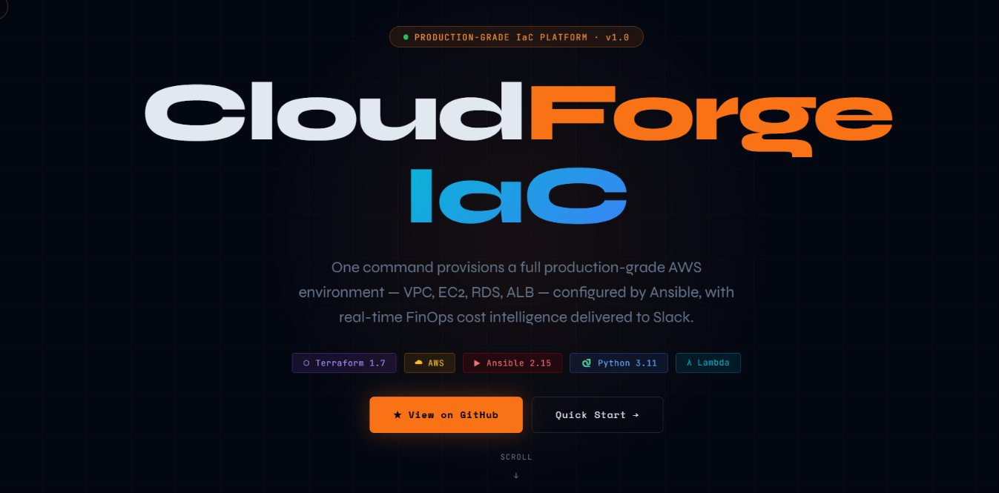
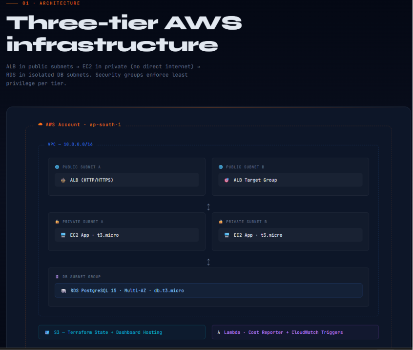
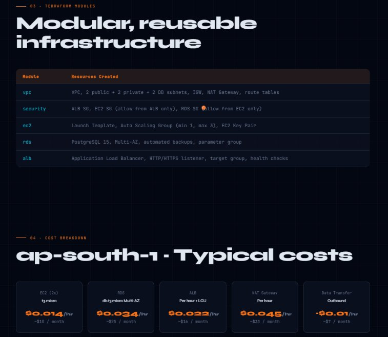
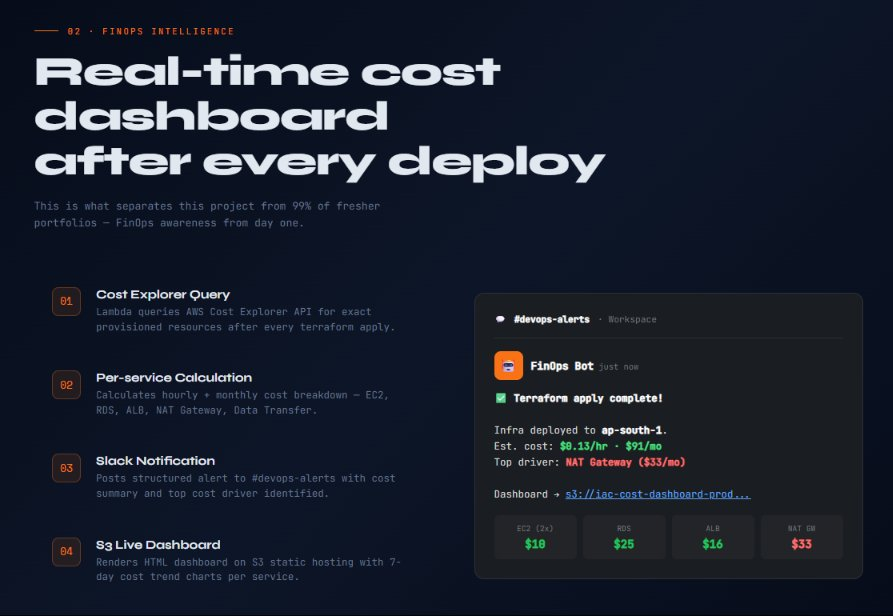
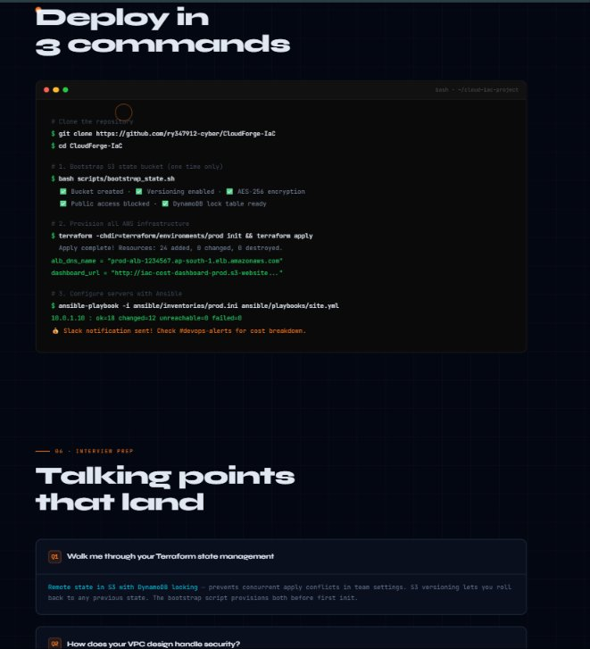

# ☁️ Cloud Infrastructure Automation Platform

### Terraform + Ansible + AWS + FinOps Cost Intelligence Dashboard


> **One command provisions a full production-grade AWS environment — VPC, subnets, EC2, RDS, ALB — configured by Ansible, with a real-time FinOps cost dashboard delivered to Slack and hosted on S3.**

---

## 🏗️ Architecture

```
┌─────────────────────────────────────────────────────────────────┐
│                        AWS Account                              │
│                                                                 │
│  ┌──────────── VPC (10.0.0.0/16) ────────────────────────────┐ │
│  │                                                            │ │
│  │  Public Subnet A          Public Subnet B                 │ │
│  │  ┌──────────────┐         ┌──────────────┐                │ │
│  │  │  ALB (HTTP/  │─────────│   ALB Target │                │ │
│  │  │  HTTPS)      │         │   Group      │                │ │
│  │  └──────┬───────┘         └──────────────┘                │ │
│  │         │                                                  │ │
│  │  Private Subnet A         Private Subnet B                 │ │
│  │  ┌──────────────┐         ┌──────────────┐                │ │
│  │  │  EC2 (App)   │         │  EC2 (App)   │                │ │
│  │  │  t3.micro    │         │  t3.micro    │                │ │
│  │  └──────┬───────┘         └──────────────┘                │ │
│  │         │                                                  │ │
│  │  DB Subnet Group                                           │ │
│  │  ┌──────────────────────────────────────┐                 │ │
│  │  │  RDS PostgreSQL (Multi-AZ)           │                 │ │
│  │  │  db.t3.micro                         │                 │ │
│  │  └──────────────────────────────────────┘                 │ │
│  └────────────────────────────────────────────────────────────┘ │
│                                                                 │
│  S3 (Terraform State)    Lambda (Cost Reporter)                 │
│  S3 (Dashboard Hosting)  CloudWatch (Triggers)                  │
└─────────────────────────────────────────────────────────────────┘
```

---

## ✨ Unique Feature — FinOps Cost Intelligence Dashboard

After every `terraform apply`, an AWS Lambda function automatically:

1. **Queries AWS Cost Explorer API** for your exact provisioned resources
2. **Calculates hourly + monthly cost** per service (EC2, RDS, ALB, Data Transfer)
3. **Posts to Slack** — *"Infra deployed. Est. cost: $0.38/hr · $275/mo. Top driver: RDS Multi-AZ"*
4. **Renders a live HTML dashboard** on S3 static hosting with charts per service

This is what separates this project from 99% of fresher portfolios — **FinOps awareness from day one.**

---

## 🚀 Quick Start

### Prerequisites
```bash
# Install tools
brew install terraform ansible awscli   # macOS
# or
sudo apt install terraform ansible awscli  # Ubuntu

# Configure AWS
aws configure
# AWS Access Key ID: <your-key>
# AWS Secret Access Key: <your-secret>
# Default region: ap-south-1
# Output format: json
```

### Deploy in 3 commands
```bash
git clone https://github.com/yourusername/cloud-iac-project
cd cloud-iac-project

# 1. Bootstrap S3 state bucket (one time only)
bash scripts/bootstrap_state.sh

# 2. Provision all AWS infrastructure
cd terraform/environments/prod
terraform init
terraform plan
terraform apply -auto-approve

# 3. Configure servers with Ansible
cd ../../../ansible
ansible-playbook -i inventories/prod.ini playbooks/site.yml
```

**Output:**
```
Apply complete! Resources: 24 added, 0 changed, 0 destroyed.

Outputs:
  alb_dns_name     = "prod-alb-1234567.ap-south-1.elb.amazonaws.com"
  ec2_private_ips  = ["10.0.1.10", "10.0.2.10"]
  rds_endpoint     = "prod-db.xxxxx.ap-south-1.rds.amazonaws.com"
  dashboard_url    = "http://iac-cost-dashboard-prod.s3-website.ap-south-1.amazonaws.com"

💰 Slack notification sent! Check #devops-alerts for cost breakdown.
```

---

## 📁 Project Structure

```
cloud-iac-project/
├── terraform/
│   ├── modules/
│   │   ├── vpc/          # VPC, subnets, IGW, NAT, route tables
│   │   ├── ec2/          # EC2, ASG, launch template, key pair
│   │   ├── rds/          # RDS PostgreSQL, subnet group, params
│   │   ├── alb/          # ALB, listener, target group, ACM cert
│   │   └── security/     # Security groups for each tier
│   └── environments/
│       └── prod/         # main.tf, variables.tf, outputs.tf
├── ansible/
│   ├── roles/
│   │   ├── common/       # OS hardening, packages, swap
│   │   ├── nginx/        # Nginx install, config, SSL
│   │   └── app/          # App deploy, env vars, systemd
│   ├── inventories/
│   │   └── prod.ini      # Dynamic inventory from Terraform output
│   └── playbooks/
│       └── site.yml
├── lambda/
│   └── cost_reporter/
│       ├── handler.py    # Cost Explorer + Slack + S3 dashboard
│       └── requirements.txt
├── dashboard/
│   └── index.html        # S3-hosted FinOps dashboard
├── scripts/
│   ├── bootstrap_state.sh
│   └── destroy.sh
└── .github/workflows/
    └── terraform.yml     # CI — plan on PR, apply on merge
```

---

## 🔧 Terraform Modules

| Module | Resources Created |
|--------|-------------------|
| `vpc` | VPC, 2 public + 2 private + 2 DB subnets, IGW, NAT Gateway, route tables |
| `security` | ALB SG, EC2 SG (allow from ALB only), RDS SG (allow from EC2 only) |
| `ec2` | Launch Template, Auto Scaling Group (min 1, max 3), EC2 Key Pair |
| `rds` | PostgreSQL 15, Multi-AZ, automated backups, parameter group |
| `alb` | Application Load Balancer, HTTP/HTTPS listener, target group, health checks |


---

## 📊 Cost Breakdown (ap-south-1, typical)

| Resource | Type | Cost/hr | Cost/mo |
|----------|------|---------|---------|
| EC2 (2x) | t3.micro | $0.014 | ~$10 |
| RDS | db.t3.micro Multi-AZ | $0.034 | ~$25 |
| ALB | Per hour + LCU | $0.022 | ~$16 |
| NAT Gateway | Per hour | $0.045 | ~$33 |
| Data Transfer | Outbound | ~$0.01 | ~$7 |
| **Total** | | **~$0.13/hr** | **~$91/mo** |

> Use `terraform destroy` when not needed. Lambda dashboard shows real-time actuals.

---

## 🏆 Interview Talking Points

**"Walk me through your Terraform state management"**
> Remote state in S3 with DynamoDB locking — prevents concurrent apply conflicts in team settings.

**"How does your VPC design handle security?"**
> Three-tier isolation: ALB in public subnets, EC2 in private (no direct internet), RDS in DB subnets with no route to IGW. Security groups enforce least privilege per tier.

**"What's your rollback strategy?"**
> Terraform state history + `terraform state rollback`. For app layer, Ansible idempotency means re-running always converges to desired state.

**"Tell me about your FinOps feature"**
> Lambda polls Cost Explorer after every apply, calculates per-service cost and posts structured breakdown to Slack. Dashboard on S3 shows 7-day cost trend. No engineer should deploy blind to cost.

---

## 🛠️ Tech Stack

`Terraform 1.7` · `AWS EC2` · `AWS RDS PostgreSQL` · `AWS VPC` · `AWS ALB` · `AWS Lambda` · `AWS S3` · `AWS IAM` · `AWS Cost Explorer API` · `Ansible 2.15` · `Python 3.11 (boto3)` · `Nginx` · `GitHub Actions`

